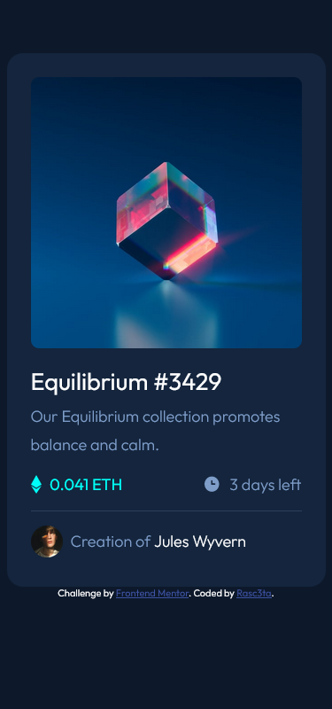
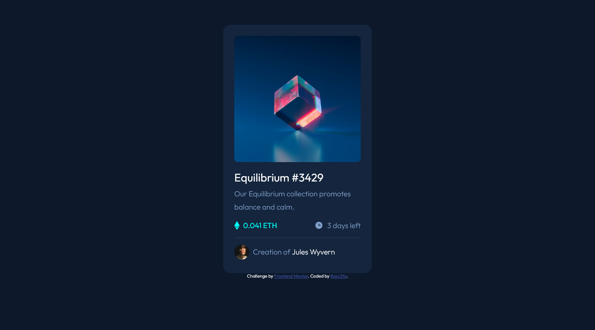
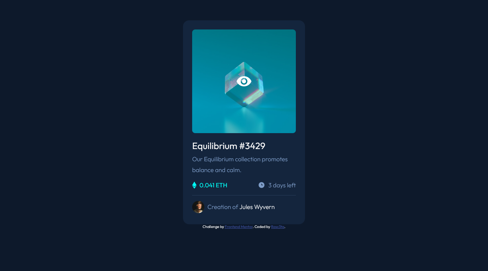

# Frontend Mentor - NFT preview card component solution

This is a solution to the [NFT preview card component challenge on Frontend Mentor](https://www.frontendmentor.io/challenges/nft-preview-card-component-SbdUL_w0U). Frontend Mentor challenges help you improve your coding skills by building realistic projects. 

## Table of contents

- [Overview](#overview)
  - [The challenge](#the-challenge)
  - [Screenshot](#screenshot)
  - [Links](#links)
  - [Built with](#built-with)
  - [Useful resources](#useful-resources)
- [Author](#author)

## Overview

 vanilla html and css . no media queries since it fits phone screens as well.
 
### The challenge

Users should be able to:

- View the optimal layout depending on their device's screen size
- See hover states for interactive elements

### Screenshot

### Links

- Solution URL: [github](https://www.github.com/nft_card)
- Live Site URL: [Add live site URL here](https://rasc3ta.github.com/nft_card)

### Built with

- Semantic HTML5 markup
- CSS custom properties
- Flexbox

### Useful resources

- [active state for the image](https://developer.mozilla.org/en-US/docs/Web/CSS/background) - this helped me make the image show the eye icon with the transparent cyan background on top of the cube image.

## Author

- Frontend Mentor - [@rasc3ta](https://www.frontendmentor.io/profile/rasc3ta)
- Twitter - [@shan5nou](https://www.twitter.com/shan5nou)
